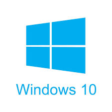

# Windows-10
My works related to Microsoft Windows 10

## Table of Contents
1. [Introduction.](#introduction)
2. [Official references websites.](#references)
3. [Windows 10 shortcuts.](#shortcuts)
4. [GitHub notes.](#github)
5. [GitHub repository calculation.](#calculation)

<a name="introduction"></a>
## 1. Introduction.
 
Windows 10 is a series of personal computer operating systems produced by Microsoft as part of its Windows NT family of operating systems. It is the successor to Windows 8.1, and was released to manufacturing on July 15, 2015, and broadly released for retail sale on July 29, 2015. Windows 10 receives new builds on an ongoing basis, which are available at no additional cost to users, in addition to additional test builds of Windows 10 which are available to Windows Insiders. Devices in enterprise environments can receive these updates at a slower pace, or use long-term support milestones that only receive critical updates, such as security patches, over their ten-year lifespan of extended support. <br /><br />

One of Windows 10's most notable features is its support for universal apps, an expansion of the Metro-style apps first introduced in Windows 8. Universal apps can be designed to run across multiple Microsoft product families with nearly identical code‍—‌including PCs, tablets, smartphones, embedded systems, Xbox One, Surface Hub and Mixed Reality. The Windows user interface was revised to handle transitions between a mouse-oriented interface and a touchscreen-optimized interface based on available input devices‍—‌particularly on 2-in-1 PCs, both interfaces include an updated Start menu which incorporates elements of Windows 7's traditional Start menu with the tiles of Windows 8. Windows 10 also introduced the Microsoft Edge web browser, a virtual desktop system, a window and desktop management feature called Task View, support for fingerprint and face recognition login, new security features for enterprise environments, and DirectX 12.

<a name="references"></a>
## 2. Official references websites.
Official Microsoft website : https://www.microsoft.com <br />
Official Microsoft Windows 10 documentation : https://docs.microsoft.com/en-us/windows/windows-10/ <br />

**_Windows 10 related documentation by Microsoft_** <br />
REAgentC command-line options : https://docs.microsoft.com/en-us/windows-hardware/manufacture/desktop/reagentc-command-line-options <br />

**_Windows 10 related articles_**
Enabling CTRL + C and CTRL + V in Windows 10 by How-To-Geek : https://www.howtogeek.com/howto/25590/how-to-enable-ctrlv-for-pasting-in-the-windows-command-prompt/ <br />
How to Copy and Paste in Command Prompt on Windows 7/10 by iSumsoft : https://www.isumsoft.com/it/how-to-copy-and-paste-in-command-prompt-on-windows-7-10/ <br />
Windows 10 tip: The fastest, smartest ways to open a Command Prompt window by ZDNet : https://www.zdnet.com/article/windows-10-tip-the-fastest-smartest-ways-to-open-a-command-prompt/ <br />
13 ways to use "Run as administrator" in Windows 10 by DIGITAL CITIZEN : https://www.digitalcitizen.life/run-as-admin <br />
Restoring Windows Recovery Environment (WinRE) in Windows 10 by Windows OSHub : http://woshub.com/restoring-windows-recovery-environment-winre-in-windows-10/ <br />

<a name="shortcuts"></a>
## 3. Windows 10 shortcuts.
**_Windows 10 desktop environment_** <br />
**[ Ctrl ]** + **[ ⊞ ]** + **[ D ]** : open new windows desktop environment <br />
**[ ⊞ ]** + **[ Tab ]** : switch between windows desktop environment <br />
**[ ⊞ ]** + **[ Ctrl ]** + **[ F4 ]** : close the windows desktop environment selection <br />

**_Windows 10 user interface management_** <br />
**[ ⊞ ]** + **[ M ]** : minimize everything <br />
**[ Alt ]** + **[ Space bar ]** : open selection menu to choose between _Restore_, _Move_, _Size_, _Minimize_, _Maximize_, _Close_ <br />

**_Windows 10 task bar management_** <br />
**[ ⊞ ]** + **[ 1 ]** : open the first application windows task bar <br />
**[ ⊞ ]** + **[ 2 ]** : open the second application windows task bar <br />
**[ ⊞ ]** + **[ 3 ]** : open the third application windows task bar <br />
**[ ⊞ ]** + **[ 4 ]** : open the fourth application windows task bar <br />
**[ ⊞ ]** + **[ 5 ]** : open the fifth application windows task bar <br />
**[ ⊞ ]** + **[ 6 ]** : open the sixth application windows task bar <br />
**[ ⊞ ]** + **[ 7 ]** : open the seventh application windows task bar <br />
**[ ⊞ ]** + **[ 8 ]** : open the eighth application windows task bar <br />
**[ ⊞ ]** + **[ 9 ]** : open the ninth application windows task bar <br />
**[ ⊞ ]** + **[ 0 ]** : open the ninth application windows task bar <br />

**_Windows 10 full screen management_** <br />
**[ Alt ]** + **[ Enter ]** : full screen mode (first hit) <br />
**[ Alt ]** + **[ Enter ]** : exit full screen mode (second hit) <br />

**_Windows 10 screen resize management_** <br />
**[ ⊞ ]** + **[ ← ]** : split the window active screen into half to the left <br />
**[ ⊞ ]** + **[ → ]** : split the window screen into half to the right <br />
**[ ⊞ ]** + **[ ↑ ]** : maximize the window screen <br />

**[ ⊞ ]** + **[ ↓ ]** : if the window screen is in maximize size mode, restore it to the default size mode <br />
**[ ⊞ ]** + **[ ↓ ]** : if the window screen is in default size mode, minimize it into the task bar <br />

**_Windows 10 applications management_** <br />
**[ Alt ]** + **[ Tab ]** : show all the running applications and choose the application from the menu 

**_Windows 10 tasks management_** <br />
**[ Ctrl ]** + **[ Shift ]** + **[ Esc ]** : open windows task manager <br />

**_Windows 10 files management_** <br />
**[ ⊞ ]** + **[ E ]** : open windows file explorer <br />

**_Windows 10 magnifier_** <br />
**[ ⊞ ]** + **[ + ]** : open windows magnifier (first hit) <br />
**[ ⊞ ]** + **[ + ]** : zoom in the targeted screen (after first hit) <br />
**[ ⊞ ]** + **[ - ]** : zoom out the targeted screen <br />
**[ ⊞ ]** + **[ Esc ]** : exit the windows 10 magnifier <br />

**_Windows 10 Focus Assist_** <br />
**[ ⊞ ]** + **[ A ]** : open windows Focus Assist menus <br />

**_Windows 10 Windows Settings_** <br />
**[ ⊞ ]** + **[ I ]** : open Windows Settings menus <br />

**_Windows 10 Lock Screen_** <br />
**[ ⊞ ]** + **[ L ]** : lock the windows screen <br />

<a name="github"></a>
## 4. GitHub notes.
Clone the current GitHub remote repository contents into local machine.
```
$ git clone https://github.com/syakirharis25/Windows-10.git
$ cd Windows-10/
$ git remote -v
$ git status
```

<a name="calculation"></a>
## 5. GitHub repository calculation.
```
-------------------------------------------------------------------------------
Language                     files          blank        comment           code
-------------------------------------------------------------------------------
Markdown                         1             18              0             71
-------------------------------------------------------------------------------
```
Refer to : https://github.com/syakirharis25/cloc
